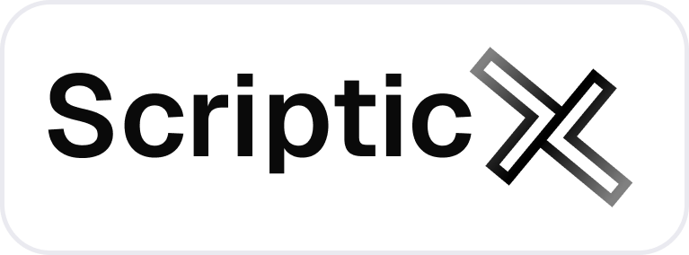
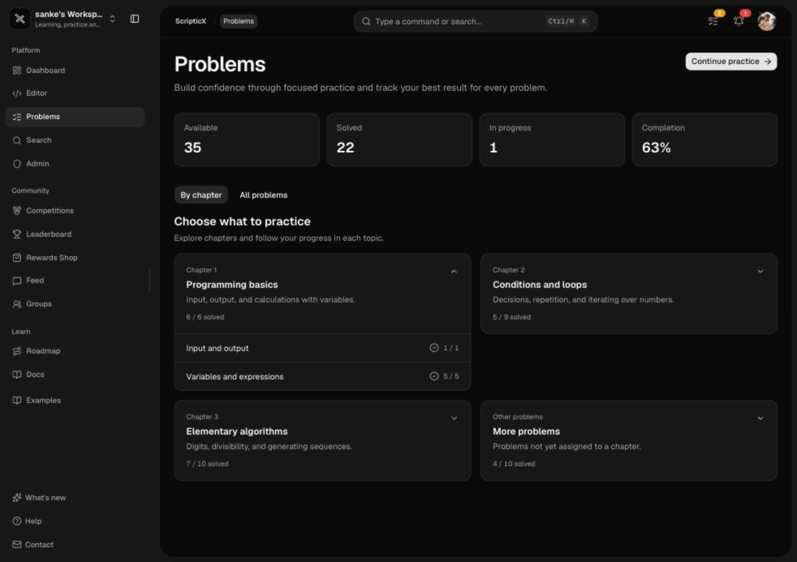
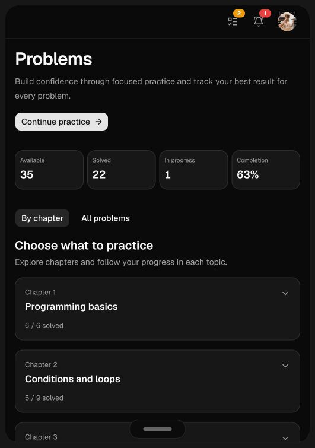

<div align="center">
  
  <p>Learn programming visually, one small idea at a time.</p>
  <p>
    <a href="https://platform.scripticx.org">Open the platform</a> ·
    <a href="https://scripticx.org">Visit the landing page</a>
  </p>
</div>

# ScripticX platform

ScripticX is a bilingual (Romanian / English) learning platform for students, teachers and independent learners. It combines the MiniScript+ language with guided lessons, automatically graded problems, a collaborative community and a browser-based editor.

The current release adds the platform experiences that were not part of the original pre-alpha: dedicated workspaces, Groups, Competitions, the Rewards Shop, a structured learning roadmap, accessibility mode and a new editor with GitHub integration.

## What is included

| Area | What users can do |
| --- | --- |
| **MiniScript+ editor** | Write, run and debug code in the browser with step-through execution, live diagnostics, syntax highlighting and custom editor settings. |
| **Learning roadmap** | Follow localized paths, chapters and lessons with quizzes, progress gates and recommended practice. |
| **Problems** | Search and solve automatically graded problems, browse chapters and download a branded PDF statement. |
| **Groups** | Chat in channels, share images and GIFs, use named custom emoji and preview media in a focused modal. |
| **Competitions** | Join public or invite-only contests, with participant invitations managed by username search or CSV upload. |
| **Rewards Shop** | Spend points on cosmetic items and manage owned items in Inventory. |
| **Workspaces** | Personal, Student and Teacher workspaces expose the tools and navigation relevant to each role. |
| **Community** | Share posts and snippets, mention users, follow progress and compare results on leaderboards. |
| **Accessibility** | Turn on a higher-contrast visual mode designed for projectors and colour-vision differences. |
| **Administration** | Manage content, chapters, announcements, roles and granular permissions from one secure admin surface. |

## Screenshots

<div align="center">
  
  <br><br>
  
  <br><br>
  
  <br><br>
  
</div>

## MiniScript+

MiniScript+ is a small educational language with readable, beginner-friendly syntax and localized runtime messages. It runs directly in the browser and includes variables, conditions, loops, functions, return values and input/output.

```msp
FUNCTION build(x, y)
  RETURN x + y
END

FOR i FROM 1 TO 5 INCR 1
  PRINT build(i, 2)
END
```

`INCR` is optional. `RETURN` ends the current function immediately and sends its value back to the caller.

## Run locally

Requirements: Node.js 20 or newer and npm 10 or newer.

```bash
git clone https://github.com/Sank34/scripticx.git
cd scripticx
npm install
```

Create `.env.local` with the Supabase project URL and anonymous key:

```dotenv
NEXT_PUBLIC_SUPABASE_URL=...
NEXT_PUBLIC_SUPABASE_ANON_KEY=...
```

Start the development server at `http://localhost:3000`:

```bash
npm run dev
```

For a production build:

```bash
npm run build
npm run start
```

## Project layout

```text
scripticx/
├── app/                    # Next.js routes and API handlers
│   ├── admin/              # Admin workspace and content management
│   ├── editor/             # MiniScript+ and multi-language editor
│   ├── learn/              # Roadmap, paths and lessons
│   ├── problems/           # Problem library and submissions
│   ├── competitions/       # Contest browsing and participation
│   ├── groups/             # Community groups and channels
│   └── workspace/          # Student and teacher tools
├── components/             # Shared UI, shell and feature components
├── hooks/                  # Client data and interaction hooks
├── lib/                    # Interpreter, permissions, i18n and services
├── public/                 # Logos, screenshots and static assets
└── supabase/migrations/    # Database schema and security migrations
```

## Architecture and security

The app uses Next.js App Router with React Server and Client Components, React Query for server-state caching, Tailwind CSS and accessible Radix-based UI primitives. Supabase provides PostgreSQL, authentication, realtime updates and storage.

Authorization is enforced in API handlers and database policies. Platform access modes, workspace restrictions, competitions and custom roles are checked server-side; UI visibility is only a convenience layer. Custom roles can grant specific tools without exposing unrelated admin capabilities.

MiniScript+ executes in the browser. Other supported languages are evaluated by an isolated execution service with explicit limits. See [`docs/code-execution.md`](docs/code-execution.md) for the execution model.

## Internationalization

The `LanguageProvider` switches the interface between Romanian and English and persists the preference for the signed-in account. Lesson, roadmap and problem content use localized fields, so each language can be edited and saved independently in the admin configurator.

## Licence

ScripticX is developed by ScripticX SRL. See the repository licence and the notices included with third-party assets before redistributing the project.
